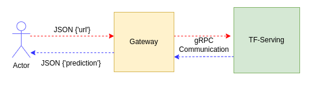
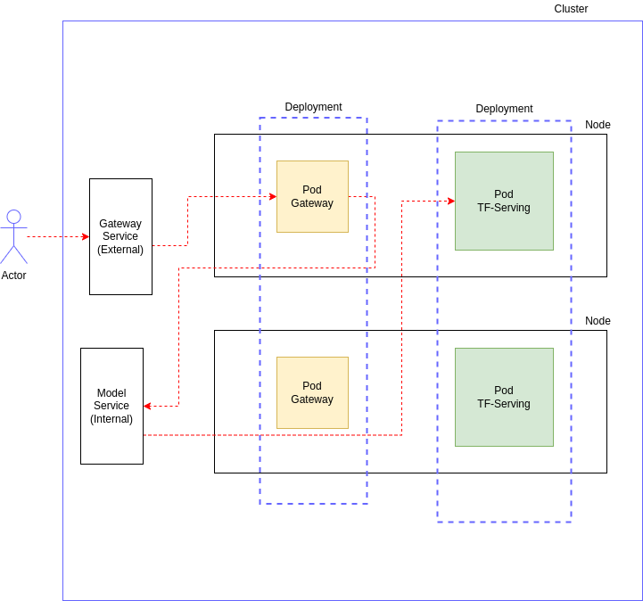

# Deploy and Serve a Tensorflow Model

In this repository we will deploy a model trained in Kera and deploy it using Docker and Kubernetes.

The following diagram shows the main architecture developed, later on we will dive into more detail.



In this case a user sends a `URL` from an image and the `gateway` transforms the image in a serialized array. The `tf-serving` model the recieves the data using the `gRPC` protocol, performs the inference and returs the result to the `gateway`. Then the `prediction` is served by the `gateway` to the user as a JSON data.

# 

# Creating Model using Tensorflow Serve

## Convert model into save model

```python
import tensorflow as tf
from tensorflow import keras

model = keras.models.load_model('xception_v4_12_0.868.h5')

tf.saved_model.save(model, 'clothing-model')
```

The generated model can be analyzed running

```bash
saved_model_cli show --dir clothing-model --all
```

where `saved_model_cli` is installed with tensorflow.

The output of this command returns information regarding the model, the most important one is the following:

```bash
signature_def['serving_default']:
  The given SavedModel SignatureDef contains the following input(s):
    inputs['input_2'] tensor_info:
        dtype: DT_FLOAT
        shape: (-1, 299, 299, 3)
        name: serving_default_input_2:0
  The given SavedModel SignatureDef contains the following output(s):
    outputs['dense_1'] tensor_info:
        dtype: DT_FLOAT
        shape: (-1, 10)
        name: StatefulPartitionedCall:0
  Method name is: tensorflow/serving/predict
```

We are specially interested in the following mapping for later usage

```bash
signature_def -> 'serving_default'
inputs -> 'input_2'
outputs -> 'dense_1'
```

## Docker container for the serve model

You can create a Docker file called `serve.dockerfile`

```docker
FROM tensorflow/serving:2.7.0

COPY ./clothing-model /models/clothing-model/1

ENV MODEL_NAME clothing-model
```

To build and run the container with the tag `clothing-model-tfserve` type

```bash
docker build -t clothing-model-tfserve --file serve.dockerfile .
docker run -it --rm -p 8500:8500 clothing-model-tfserve
```

## Test Docker Container locally

To test the model our input must be in a Protocol Buffer format. Protocol Buffers (a.k.a., protobuf) are Google's language-neutral, platform-neutral, extensible mechanism for serializing structured data.

In our case, we get a numpy array from an image hosted in a `url` using our custom function `get_url`

```python
X = get_url(url)
```

Then we convert this numpy array into a protobuf format using

```python
X_proto = tf.make_tensor_proto(X, shape=X.shape)
```


# Creating Gateway

## gRPC Communication

When deploying models with Tensorflow Serve the communication is done using gRPC whic is a modern open source high performance Remote Procedure Call (RPC)
framework that can run in any environment. Therefore to communicate with our Tensorflow Serve model we need to use gRPC in our Gateway model.

Mainly we need to import the following libraries

```python
import grpc

from tensorflow_serving.apis import predict_pb2
from tensorflow_serving.apis import prediction_service_pb2_grpc
```

The key idea in performing a communication of this type is as follows:

* Serialize a numpy array into a protocol buffer or protobuffer structure.

```python
X_proto = tf.make_tensor_proto(X, shape=X.shape)
```

* Send a protobuffer request with the serialized data.

```python
host = 'localhost:8500'
channel = grpc.insecure_channel(host)

stub = prediction_service_pb2_grpc.PredictionServiceStub(channel)
```

* Use a stub on a created channel and defined host to make predictions.

```python
pb_request = predict_pb2.PredictRequest()
pb_request.model_spec.name = 'clothing-model'
pb_request.model_spec.signature_name = 'serving_default'

pb_request.inputs['input_2'].CopyFrom(X_proto)
pb_response = stub.Predict(pb_request, timeout=20.0)

prediction = pb_response.outputs['dense_1'].float_val
```

All the code can be found in `flask_service_tf.py` and `flask_service.py` the only difference between these two files is that in `flask_service.py` we took out the dependecies for Tensorflow and used an auxiliary library to replace `tf.make_tensor_proto` to reduce the size of the container in later deployment.


# Deploying Docker Containers

## Tensorflow Serve Container

This cointainer is very simple since it only needs an image of Tensorflow Serve and the model itself. A simple dockerfile named `serve.dockerfile` is created like this

```dockerfile
FROM tensorflow/serving:2.7.0

COPY ./clothing-model /models/clothing-model/1

ENV MODEL_NAME clothing-model
```

You can build the container as follows

```bash
docker build -t clothing-model-tfserve -f serve.dockerfile .
```

## Gateway Container

First we create a pip environment in the following way

```bash
pipenv install numpy pillow grpcio gunicorn tensorflow-protobuf \
tensorflow-serving-api flask
```

The we make a dockerfile named `gateway.dockerfile`

```dockerfile
FROM python:3.8-slim

RUN pip install pipenv

#Set current directory as /app and cd into it
 WORKDIR /app

#Copy Pipfile and Pipfile.lock into ./
COPY ["Pipfile", "Pipfile.lock", "./"]

#We use this to install pipenv in the system, not in docker
RUN pipenv install --system --deploy

COPY ["flask_service.py", "proto.py", "./"]

#Expose port 9696
EXPOSE 9696

# We are actually runing this entrypoint=gunicorn --bind 0.0.0.0:9696 flask_service:app
ENTRYPOINT ["gunicorn", "--bind=0.0.0.0:9696", "flask_service:app"]
```

You can build the container as follows

```bash
docker build -t clothing-gateway -f gateway.dockerfile .
```

## Docker Compose

To easily manage our containers we can use Docker Compose, to do so we create a yaml file in the following way

```yaml
version: "3.9"
services:
  clothing-model:
    image: clothing-model-tfserve:latest
  gateway:
    image: clothing-gateway:latest
    environment:
      - TF_SERVING_HOST=clothing-model:8500
    ports:
      - "9696:9696"
```

In here we have two services named `clothing-model` and `gateway`. The `gateway` service exposes port 9696 to the outside and uses an environment variable named `TF_SERVING_HOST` which allow us to define the destination when making a request to the `clothing-model`. Note that on  `flask_service_tf.py` we used this variable.

To use docker compose run

```bash
docker compose up
```

To turn it off run

```bash
docker compose down
```

# 

# Deploy using Kubernetes

To deploy our project we will use Kubernetes, in order to do so, the following architecture has been created.



* **Node**: A server or computer.

* **Pod**: A Docker Container that runs on a node.

* **Deployment**: A group of nodes with the same image and configuration.

* **Service**: It is the entry point of an application. It routes requests to pods. Two basic types:
  
  * **Load Balancer**:  It is an external type that can be used to connect from the outside with a pod.
  
  * **Cluster IP**: It is an internal type, used by default.

* **Ingress**: The entrypoint of a cluster.

* **HPA**: Horizontal Pod Autoscaler

## Creating Deployments and Services

First we neet to install `kubectl` and `kind`. After that, we need to create a cluster by running

```bash
kind create cluster
```

We can list all services, pods and deployments with the following commands

```bash
kubectl get service

kubectl get pod

kubectl get deployment
```

To get information of a specific pod you can run

```bash
kubectl describe pod tf-serving-clothing-model-656f96f4dd-4j9n2
```

In this case `serving-clothing-model-656f96f4dd-4j9n2` is the name of the pod.

To deploy our containers we assume that we have the following ones:

* `clothing-model-tfserve:ver1`

* `clothing-gateway:ver1`

Note that both have the tag `ver1` because Kubernetes doesn't like to use the `latest` tag, so we created new ones with this tag.

## Tensorflow Serving - Deployment

A `model-deployment.yaml` file was created with all the parameters configured to use the `clothing-model-tfserve:ver1` image. To add our container to the local Kubernetes cluster you can run

```bash
kind load docker-image clothing-model-tfserve:ver1
```

To deploy the model run

```bash
kubectl apply -f model-deployment.yaml
```

To delete the deployment run

```bash
kubectl delete -f model-deployment.yaml
```

To test your deployment you can use port forwarding, this is done by running

```bash
kubectl port-forward tf-serving-clothing-model-656f96f4dd-4jc6h 8500:8500
```

## Tensorflow Serving - Service

A `model-service.yaml` file was configured to use our `tf-serving-clothing-model`app.

You can deploy the service by typing

```bash
kubectl apply -f model-service.yaml 
```

To test your deployment you can use port forwarding in the following way

```bash
kubectl port-forward service/tf-serving-clothing-model 8500:8500
```

## Gateway - Deployment

A `gateway-deployment.yaml` file was created with all the parameters configured to use the `clothing-gateway:ver1` image. To add our container to the local Kubernetes cluster you can run

```bash
kind load docker-image clothing-gateway:ver1
```

To deploy the model run

```bash
kubectl apply -f gateway-deployment.yaml
```

## Gateway - Service

A `gateway-service.yaml` file was configured to use as our entry point.

You can deploy the service by typing

```bash
kubectl apply -f gateway-service.yaml 
```

To test your deployment you can use port forwarding in the following way

```bash
kubectl port-forward service/gateway 8080:80
```
